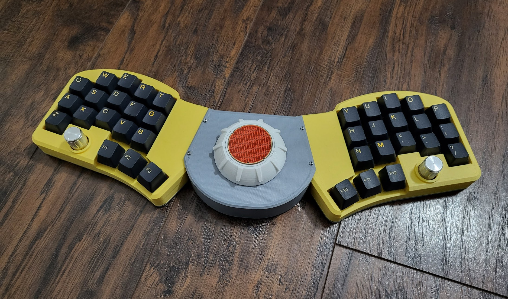
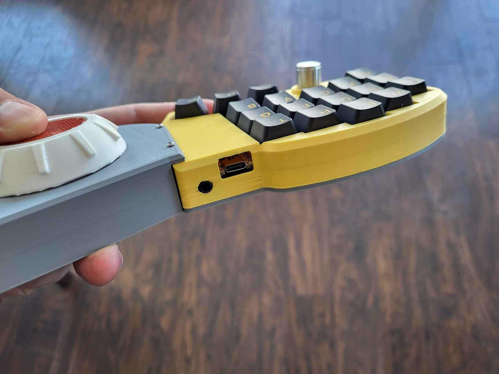
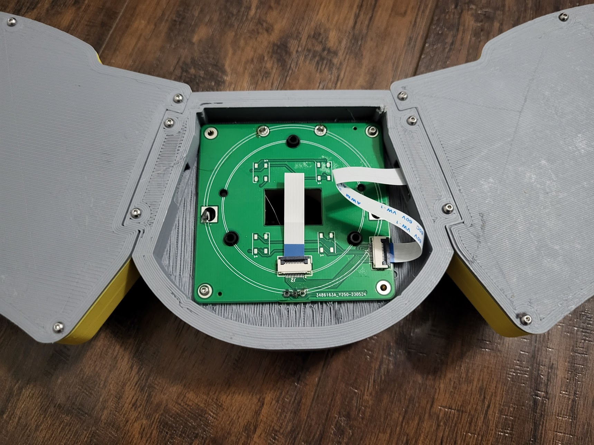
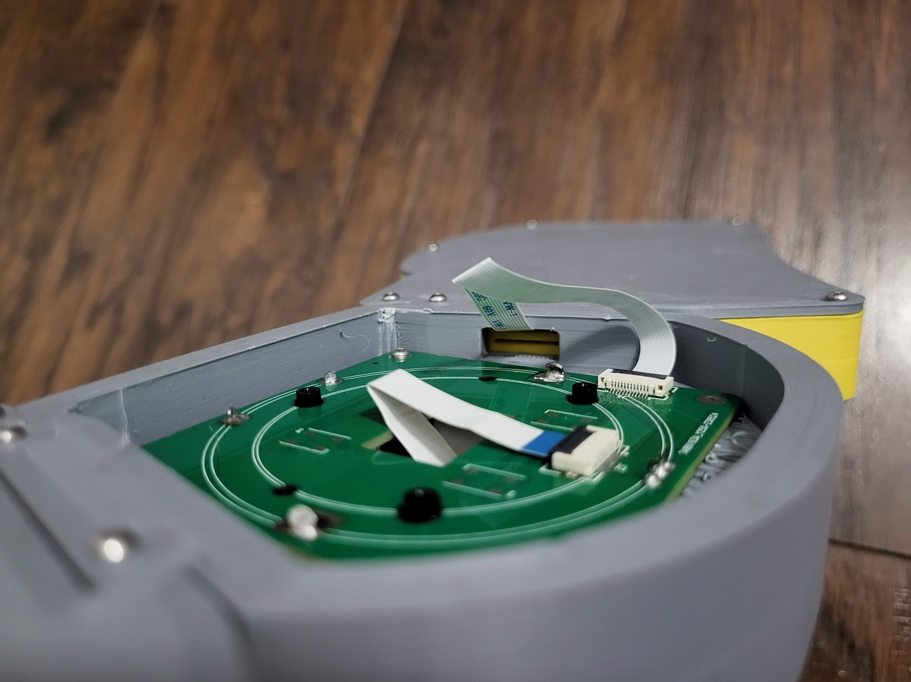
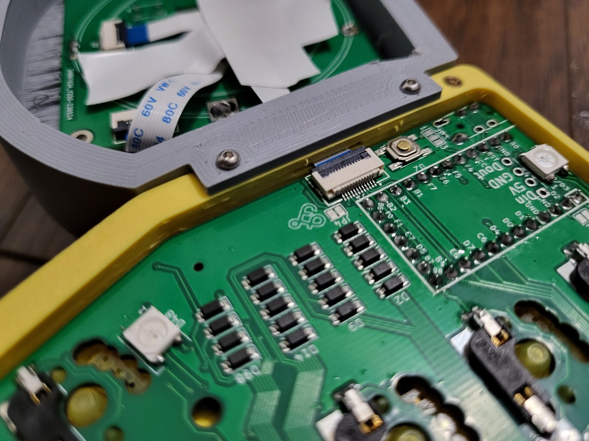
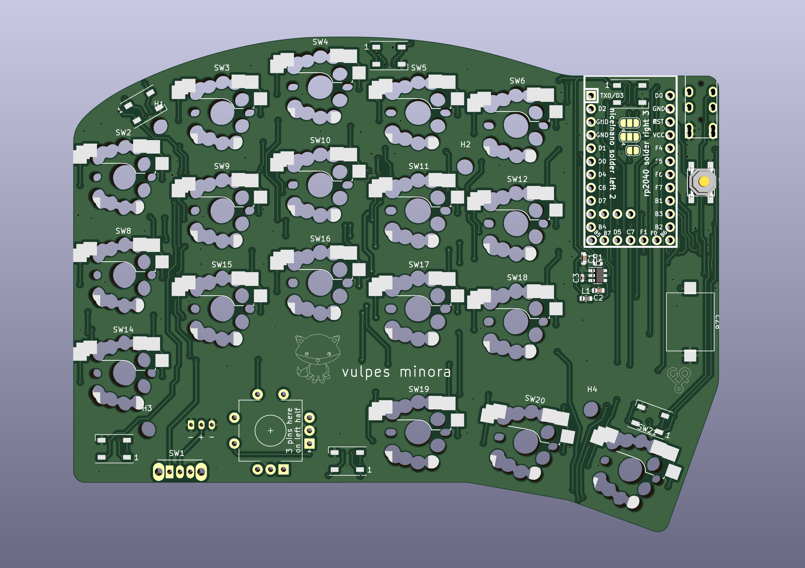
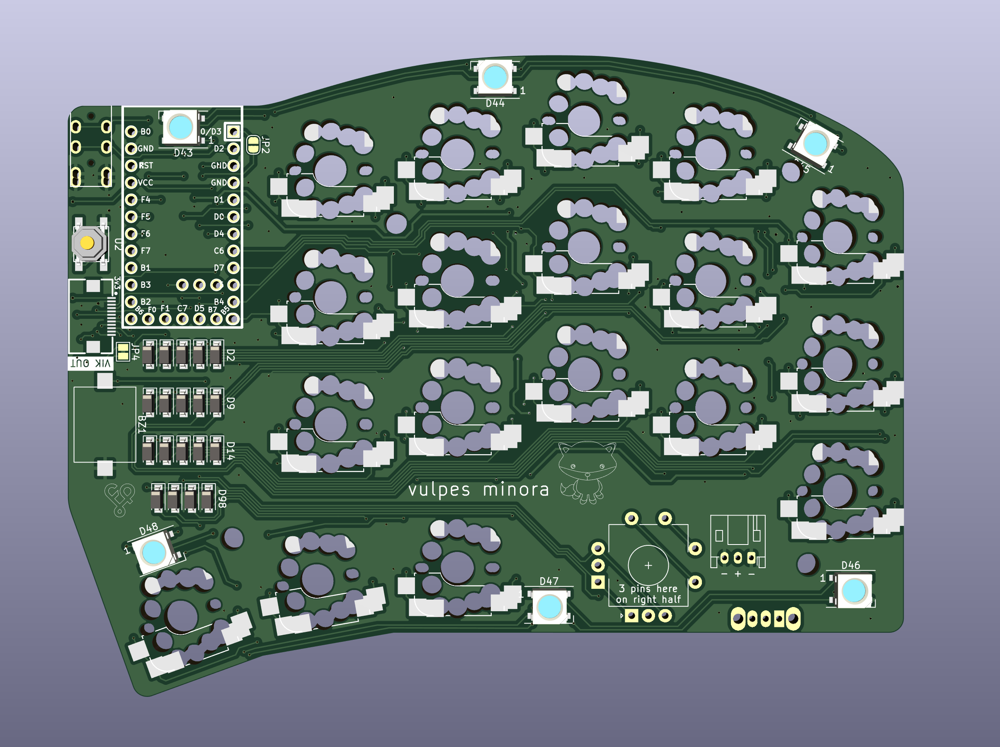
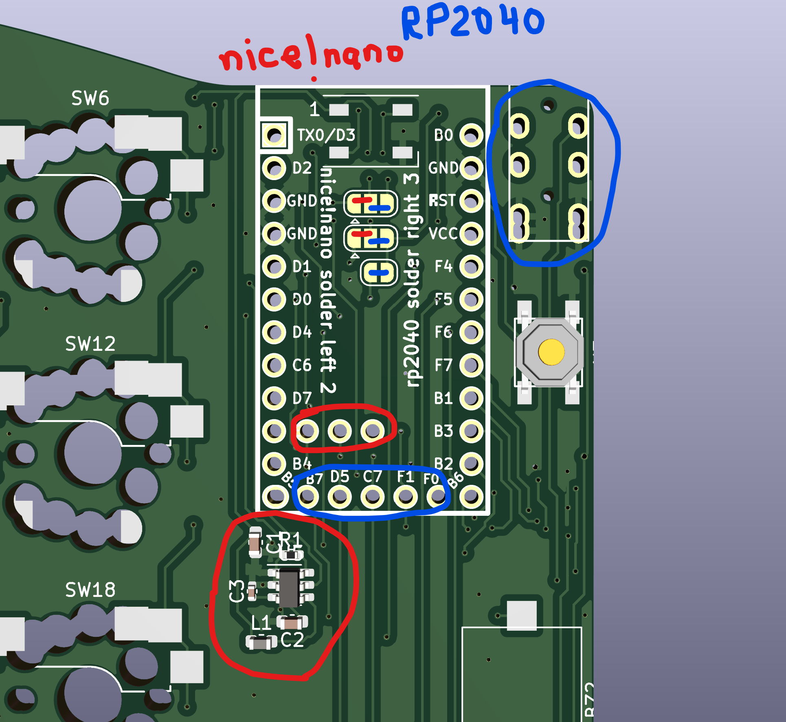
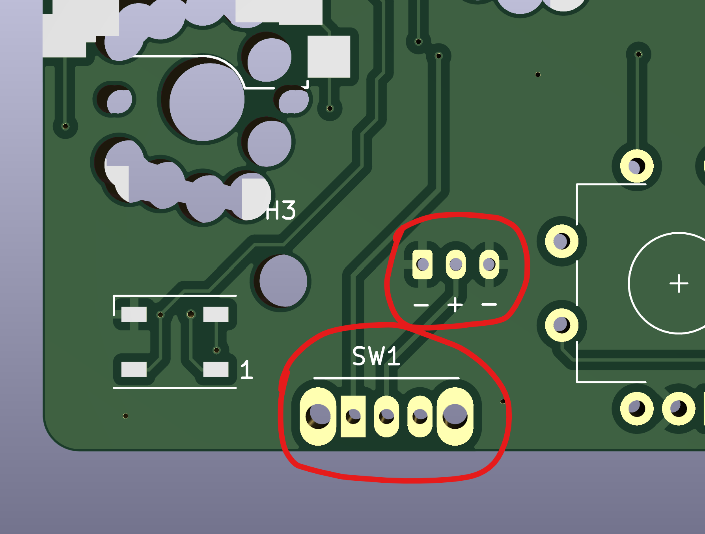

# vulpes minora

This is a 36 key split pcb, specifically designed with the intent to demonstrate a VIK certified keyboard. Read all about that in the [vik github repository](https://github.com/sadekbaroudi/vik)

## Features

vulpes minora supports the following features:
* 36 keys
* Reversible PCB
* MX / Choc / KS-27 and KS-33 switch support, hotswap only
* Underglow
* EC11 rotary encoders (byo-mcu and RP2040-Zero version only)
* Audio buzzer (byo-mcu only)
* VIK support (byo-mcu and RP2040-Zero version only)
* Wireless + VIK support (using nice!nano controller, byo-mcu version only)

Note: while the xiao-xivik version doesn't support VIK, the intent of this PCB is to allow you to build a vulpes majora using a [xivik controller](https://fingerpunch.xyz/product/xivik), which **does** provide you VIK support

## VIK keyboard certification card

| Category                 | Classification          | Response           |
| -----------------------  | ----------------------- | ------------------ |
| FPC connector            | Required                | :heavy_check_mark: |
| Breakout pins            | Recommended             | :x:                |
| Supplies: SPI            | Strongly recommended    | :heavy_check_mark: |
| Supplies: I2C            | Strongly recommended    | :heavy_check_mark: |
| I2C on main PCB          | Discouraged             | :x:                |
| I2C pull ups             | Informative             | N/A                |
| Supplies: RGB            | Strongly recommended    | :heavy_check_mark: |
| Supplies: Extra GPIO     | Strongly recommended    | :heavy_check_mark: |

## Build pics

This is a build using the [byo-mcu pcb](https://github.com/sadekbaroudi/vulpes-minora/tree/master/pcb/byo-mcu) keyboard pcb and the [per56-cirque-leds](https://github.com/sadekbaroudi/vik/tree/master/pcb/per56-cirque-leds) module.

## Fabrication

You can make this board yourself! I recommend [JLCPCB](https://jlcpcb.com/).

All you need to do is upload the gerber.zip found in the production folder of either the byo-mcu or rp2040-zero folders. I also recommend you do PCBA. If you'd like to do this, you can use the bom.csv and positions.csv in the same folder.

## Firmware

See QMK firmware here:

https://github.com/sadekbaroudi/qmk_firmware/tree/master/keyboards/fingerpunch/vulpes_minora

## Bill of materials

### PCB (byo-mcu)

| Part name                                                                    | Part Link (example)                                                                                                                                                | Required               | Quantity               |
| ---------------------------------------------------------------------------- | ------------------------------------------------------------------------------------------------------------------------------------------------------------------ | ---------------------- | ---------------------- |
| SOD-123 1N4148W diodes                                                       | https://www.lcsc.com/product-detail/Switching-Diode_GOODWORK-1N4148W_C909967.html                                                                                  | :heavy_check_mark:     | 36 (38 if using EC11 ) |
| TRRS jack                                                                    | https://www.amazon.com/uxcell-Audio-Connector-Mount-Socket/dp/B0BJJW9KVZ                                                                                           | :heavy_check_mark:     | 2                      |
| Hotswap sockets (MX, choc, or ks-27/33)                                      | No link, easy to find these                                                                                                                                        | :heavy_check_mark:     | 36                     |
| RP2040 elite-c footprint compatible controller (elite-pi, splinky)           | https://keeb.io/products/elite-pi-usb-c-pro-micro-replacement-rp2040   https://github.com/plut0nium/0xB2   https://github.com/0xCB-dev/0xCB-Helios       | :heavy_check_mark:     | 2                      |
| nice!nano for wireless build (replaces RP2040 controller)                    | No link, easy to find these                                                                                                                                        | :heavy_check_mark:     | 2                      |
| (wireless only) OS102011MA1QN1 - on/off switch                               | Search for part number                                                                                                                                             | :heavy_check_mark:     | 2                      |
| (wireless only) JST 2 pin connector, S2B-PH-K-S                              | https://www.digikey.com/en/products/detail/jst-sales-america-inc./S2B-PH-K-S/926626                                                                                | :heavy_check_mark:     | 2                      |
| (wireless only) DC-DC step up (VIK 3.3v to 5v, not req for most VIK modules) | Open kicad schematic, review parts that say "Batt -> 5V step up for VIK". Looks at LCSC value and search lcsc.com for part                                         | :x:                    | 2 for each pert        |
| SKQGA* (example SKQGADE010) - reset switch                                   | https://www.lcsc.com/product-detail/Tactile-Switches_ALPSALPINE-SKQGADE010_C116647.html                                                                            | :heavy_check_mark:     | 2                      |
| WS2812B leds (recommended for wired only)                                    | https://www.lcsc.com/product-detail/Light-Emitting-Diodes-LED_Worldsemi-WS2812B-B-T_C2761795.html                                                                  | :x:                    | 12                     |
| VIK connector (FPC 12 pin 0.5mm pitch)                                       | https://www.lcsc.com/product-detail/FFC-FPC-Connectors_SHENZHEN-ATOM-TECH-FPC05012-09200_C479750.html                                                              | :x:                    | 2                      |
| EC-11 encoders                                                               | No link, easy to find these                                                                                                                                        | :x:                    | 2                      |
| Audio buzzer (KLJ-1102)                                                      | https://www.lcsc.com/product-detail/Buzzers_KELIKING-KLJ-1102_C201047.html                                                                                         | :x:                    | 2                      |

### Module

For the module, see the [VIK repository](https://github.com/sadekbaroudi/vik) for a list of [VIK compatible modules](https://github.com/sadekbaroudi/vik#known-list-of-vik-certifications).

## Build instructions

### byo-mcu (wired vs wireless)

When building the byo-mcu PCB, you can use a RP2040 elite-c footprint compatible controller, or you can use a nice!nano for wireless.

vulpes-minora-byo-mcu-side2.png

Depending on which controller you use, you will need to solder certain pads. Certain components will be required for one build, and should not be included in the other. See the images below as a reference for this:

